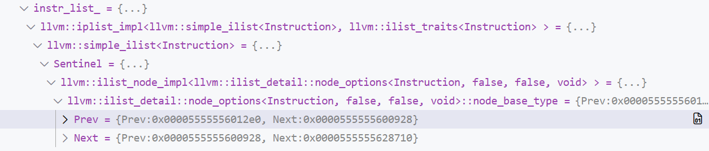
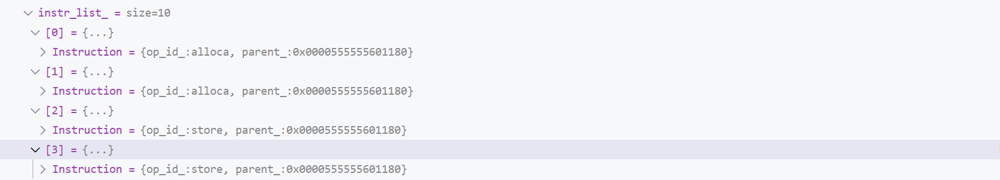
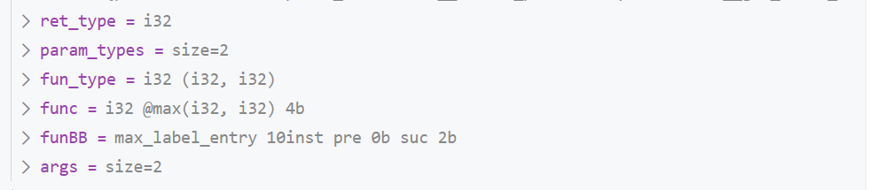
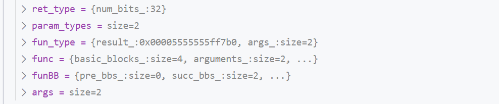
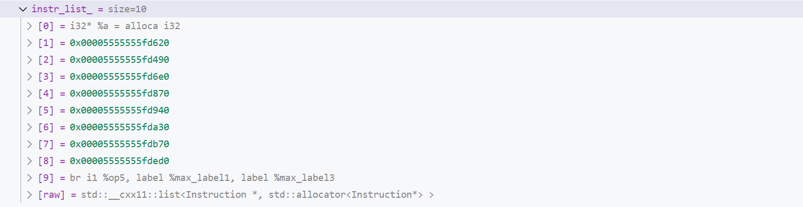

# 助教代码介绍

## 切换到助教代码

```bash
# 保存所有更改
git add *
git commit -m
# 拉取新更新
git pull upstream
# 切换分支
git checkout -b ta --track upstream/ta
```


然后手动复制你完成了的 Lab3 Phase2 代码到对应的文件夹（如果你做的是 Lab4 则不需要复制）。你可以先将 `CodeGen.cpp` 下载到本地，这样能够比对 `TODO` 并复制你的实验进度。
**注意只复制 TODO 部分**，复制整个文件将需要你手动修复大量代码错误。

!!! Note "下载 **CodeGen.cpp**" 

	在 VSCode 右键 `CodeGen.cpp`，点击 `下载`。

### 更改代码

由于实验框架的变动，你完成的代码中少量的代码（主要是 Light IR 相关的代码）需要更改，（如果没有开始 Lab3 Phase2，或你目前要做的是 Lab4，则不需要更改）主要是以下几个部分：

- `ASMInstruction::Atrribute` 需要重命名为 `ASMInstruction::Attribute`。
	- 你可以 `Ctrl + F` 唤出搜索栏，点击搜索栏最左边的箭头唤出替换栏，然后将 `Atrribute` 全部替换为 `Attribute`，因为这实际上是以前的框架拼错了。
- 使用 for 循环 `for(auto &i: bb)` 遍历基本块时，以前这里的 `i` 是 `BasicBlock`，现在是 `BasicBlock*`，因此它周围可能有智能提示报告错误，你需要去掉一些使用 `&` 取地址的操作，对这个错误进行修复。
	- 对 Instruction 也有同样的问题
	- 围绕 BasicBlock 和 Instruction 的报错基本上是因为这个


然后你可以编译你的代码，我们推荐使用 VSCode 运行 cmake，而非手动输入 `cmake ..`，因为后者捕捉不到 cmake 文件的变化。

### 编译代码

#### 打开仓库

确保 vscode 打开的文件夹是你的仓库，即


而不是


如果是后者，首先在命令行切换到仓库文件夹，然后输入 `code .` 打开一个新 VSCode 窗口

例如

```shell
yang@xxx:~/ta$ cd 2025ustc-jianmu-compiler/
yang@xxx:~/ta/2025ustc-jianmu-compiler$ code .
```

#### 使用 VSCode CMake

首先 `Ctrl + Shift + P` 调出命令窗口，输入 `Cmake: Select a Kit` 选择工具包

 

然后选择其中的 Clang


如果你发现只有扫描工具包选项，点击扫描工具包，然后再次 `Ctrl + Shift + P` 重复输入指令。

当你的 clang 实在无法通过编译或正常调试，可以使用 gcc，后者在与 lldb 协作调试时有一些问题，但不影响实验。
注意可能有多个 gcc 选项，若要进行 linux 调试，路径应该是 `/usr/bin/gcc` 而非其它路径。

现在可以运行 cmake，我们推荐使用 VSCode CMake 插件进行 CMake，而非命令行调用 `cmake ..`，你需要

- 删除 `build` 文件夹以刷新缓存
- 点进最外层的 `CMakeLists.txt` 文件，`Ctrl + S` 保存，它会自动配置 cmake

然后你可以在 `build` 文件夹进行 `make`。

???+ Note "Q&A" 

	`Ctrl + S` 没有配置 cmake?

	- `Ctrl + Shift + P` 输入指令 `CMake: Configure` 进行配置

	配置之后 make 报错显示没有指定目标?

	- 点击 VSCode 左下角设置，进行如下设置
	

若你使用命令行运行 cmake，仍然推荐你删除 `build` 文件夹以刷新缓存，你需要 cmake 命令行日志中注意使用的编译器确实是 clang。

## 使用 VSCode 进行调试

新框架的主要功能是与 CodeLLDB 集成的调试，例如同样断点，旧框架显示


新框架显示


为了进行调试，你首先需要创建 `launch.json`，助教代码中已经创建好，例如

```JSON
{
    "configurations": [
        {
            "type": "lldb",
            "request": "launch",
            "name": "Compile & Gen 1.ll",
            // 要调试的程序
            "program": "${workspaceFolder}/build/cminusfc",
            // 命令行参数
            "args": [
                "-emit-llvm",
                "./build/1.cminus",
                "-o",
                "./build/1.ll"
            ],
            // 程序运行的目录
            "cwd": "${workspaceFolder}",
            // 程序运行前运行的命令(例如 build)
            "preLaunchTask": "make cminusfc",
			// codelldb 集成
            "initCommands": [
                "command script import ${workspaceFolder}/lldb_formatters.py"
            ]
        }
	]
}
```

创建一个名为 `Compile & Gen 1.ll` 的调试选项，点击 VSCode 左侧调试栏，你可以找到所有你定义的选项


点击就可以进行调试。

上文这个选项实际运行了程序 `./build/cminusfc -emit-llvm ./build/1.cminus -o ./build/1.ll`，
在运行之前，由于设置了 `preLaunchTask`，还会取 `tasks.json` 里的对应指令，也就是每次都编译。

如果你某个样例测试不通过，可以找到它对应的 `cminus` 文件，右键复制相对路径，并更改对应的调试指令来进行调试。

### 调试信息

若你不打断点，调试会很快结束（除非 assert 报错，程序会在 assert 停下来），你可以使用 assert 或者断点来停下来程序，例如下图在行号位置单击打断点。

打断点不一定停下来，特别是在函数返回时，有的编译器会停在 `return`，有的会停在函数结束的 `}` 处，你可以多打几个。


调试界面具有很多信息，右上角漂浮的窗口用于控制目前调试器的行为。这些图标作用分别为：

- 继续，从程序停止处开始执行，直到遇到下一个断点暂停或程序结束
- 逐过程，执行到下一行的位置停止，如果函数返回了就返回然后停住
- 单步调试，和下一步类似，但当你在函数调用上打了断点，"逐过程" 会执行到下一行，但是"单步调试"会进入调用的函数的第一行。
- 单步跳出，执行完当前的函数，然后暂停，当你点击"单步调试"进入函数后，单步跳出会执行完进入的函数并退出
- 重启，重新开始调试。
- 停止，停止调试，同时终止程序。

左侧的侧边栏拥有变量信息，包括

- `Local` 栏，具有调试程序暂停的时刻每个局部变量的值，暂停在类的内部还包含 `this`，单步跳出后还包含返回值
- `Static` 栏，包含暂停到的文件中的全局变量的值，暂停在不同的文件会显示不同的全局变量

下方具有堆栈和断点信息，包括

- 调用堆栈栏

例如下面代码

```c
void a() {
	int p = 2;
	b();
}
void b() {
	int t = 1;
	c();
}
void c() {
	int val = 0; // 断点停止处
}
```

停止在断点上后，调用堆栈从屏幕下往上依次是 `c`, `b`, `a`。如果你点击 `b`，页面就会导航到 `b` 进入 `c` 的地方，然后你可以查看局部变量 `c` 的值。

当程序运行出错，进入一些汇编代码时，调用堆栈告诉你它是如何执行到错误的地方，通过局部变量还可以判断具体是什么错误。

- 断点栏

显示你打了哪些断点，它们在哪里，以及你可以在这里暂时禁用它们。


### 调试变量

变量栏的变量以 `名称 + 描述` 对出现。

鼠标悬停在名称上，它可以显示变量的类型。鼠标悬停在描述上，它会将描述展开（如果页面太短了看不到描述）。

点击某个变量，你就可以看到它的成员。特别的，如果 `class A : B`，你展开 `A` 能看到一个 `B`，它是 `A` 中包含的父类信息。


???+ Note "Q&A" 

	调试窗口变量的描述与文档中的图片不同，非常复杂难以阅读?

	这可能是由于 lldb 没有正常工作。

	在命令行输入 `lldb` 回车，若显示 `ModuleNotFoundError: No module named 'lldb.embedded_interpreter'`，可能就是这个问题。这是 lldb 的一个 bug，原因是 llvm 需要使用它自带的 python 文件，但是它设置错了自己的默认 python 路径。

	输入 `exit` 退出刚才的环境，输入 `lldb -P`，会显示 llvm 默认 python 路径，例如 `/usr/lib/local/lib/python3.10/dist-packages`。这个 python 路径也许不存在，你需要创建 `/usr/lib/local/lib/python3.10` 文件夹。

	然后你需要寻找 llvm 自带的 python，它一般在 `/usr/lib/llvm-14/lib/python3.10/dist-packages`，然后将它链接到 llvm 默认路径，这里即 `sudo ln -s /usr/lib/llvm-14/lib/python3.10/dist-packages /usr/lib/local/lib/python3.10/dist-packages`。

	不同的机器可能具有不同的路径。


## 框架更新介绍

此处介绍助教代码相对原有框架进行的所有更新

### 去除 llvm ilist 依赖

所有的 `llvm::ilist<Instruction>` 都换成了 `std::list<Instruction*>`，并且对 llvm 的依赖从 cmake 中去除。

原有的 llvm::ilist 无法被 lldb 正确识别。导致调试时无法看到一个函数有哪些基本块，一个基本块有哪些指令；



使用 std::list 虽然性能受损，但是可以在调试时看到所有的基本块和指令。



代价是有些地方 `BasicBlock`，`Instruction` 变成了它们的指针，如果你要复用原来你自己写的代码，你需要改改。

### 使用两段化 Instruction List

每个基本块中的指令列表被分为两段

```
block_label:
--------------------
alloca / phi segment
--------------------
other inst segment
--------------------
```

调用 `add_inst` 等 api 插入指令时，`alloca` 和 `phi` 指令会被插入第一段，而其它指令会被插入第二段，插入顺序和 api 的描述一致。创建指令也是如此。
因此，你可以在一个已经终止的块中创建 `phi` 和 `allca`。

特别的，`IRBuilder` 中的 `create_alloca` 会将 `alloca` 指令放置在函数的入口块

```C++
AllocaInst *create_alloca(Type *ty, const std::string& name = "") const
{
    return AllocaInst::create_alloca(ty, this->BB_->get_entry_block_of_same_function(), name);
}
```

这么做的一个原因是与 llvm 兼容。你可能已经注意到栈式分配给每个 `alloca` 都分配且仅分配一个位置，但是 llvm lli 却在执行时每次遇到 `alloca` 都分配一次空间，
这导致循环中的 `alloca` 内存泄漏，lli 报错

```c++
while(1)
{
	int a;
}
```

识别 `alloca` 是否在循环中，然后将它提到循环外是多此一举。无论栈式还是寄存器分配，`alloca` 指令的位置都不影响最终的汇编性能，
所以我们可以简单的全放到函数入口块指令列表的第一段，**入口块不可能有前驱基本块**，因此不可能位于循环中。

`phi` 指令具有不同的考量，当你发现你需要插入一个 `phi`，通常是选择语句对一个变量进行了不同的赋值

```c++
if(xxx)
	a = 0;
else
	a = 1;
b = a;
```

然后你需要将它转换为 SSA

```c++
if(xxx)
	a = 0;
else
	a1 = 1;
a2 = phi(a, a1);
b = a2;
```

a2 放在哪里？它需要放在所有本基本块使用到 a 的变量的前面，不过最省事的做法是直接丢到基本块开头，也就是指令列表第一段。

`phi` 的操作数来自于前驱基本块，由于入口块不可能有前驱块，入口块不存在 `phi`，这样，可以认为入口块第一段只有 `alloca`，而非入口块第一段只有 `phi`。

段的区分在接口中没有明显体现，当你遍历指令列表，你还是会遍历所有指令，只不过 `alloca` 和 `phi` 都在指令列表开头的地方。

### 去除 Instruction 类的冗余模板

将

```cpp
template <typename Inst> class BaseInst : public Instruction {
  protected:
    template <typename... Args> static Inst *create(Args &&...args) {
        return new Inst(std::forward<Args>(args)...);
    }

    template <typename... Args>
    BaseInst(Args &&...args) : Instruction(std::forward<Args>(args)...) {}
};

class IBinaryInst : public BaseInst<IBinaryInst> {
    friend BaseInst<IBinaryInst>;

  private:
    IBinaryInst(OpID id, Value *v1, Value *v2, BasicBlock *bb);

  public:
    static IBinaryInst *create_add(Value *v1, Value *v2, BasicBlock *bb);
    static IBinaryInst *create_sub(Value *v1, Value *v2, BasicBlock *bb);
    static IBinaryInst *create_mul(Value *v1, Value *v2, BasicBlock *bb);
    static IBinaryInst *create_sdiv(Value *v1, Value *v2, BasicBlock *bb);

    virtual std::string print() override;
};
```

变为
```CPP
class IBinaryInst : public Instruction {

  private:
    IBinaryInst(OpID id, Value *v1, Value *v2, BasicBlock *bb, const std::string& name);

  public:
    static IBinaryInst *create_add(Value *v1, Value *v2, BasicBlock *bb, const std::string& name = "");
    static IBinaryInst *create_sub(Value *v1, Value *v2, BasicBlock *bb, const std::string& name = "");
    static IBinaryInst *create_mul(Value *v1, Value *v2, BasicBlock *bb, const std::string& name = "");
    static IBinaryInst *create_sdiv(Value *v1, Value *v2, BasicBlock *bb, const std::string& name = "");

    std::string print() override;
};
```

原来的那个实现是祖传代码，我们的实验实际上用不到这种抽象，并且它还会导致报错时点击报错函数导航到 `BaseInst` 这个空模板，影响 debug。


### 创建时命名

实现了一个名称分配器类 `Names`。当创建基本块和非 `void` 指令时，即使你不指定名称，它也会给它们立刻分配一个名称。

`Names` 会确保分配的名字不重复，目前助教代码中所有 `alloca` 指令指定的名字都是 `cminus` 中变量的名字。

以前基本块和指令的名称直到调用 `print` 时才分配，在这之前一直是空的。当你想要打断点调试时，你会发现你分不清不同指令和基本块。

### LLDB Summary

每个类都有自定义的 lldb summary，也就是



如果不实现这个你会看到



如果你发现你的 summary 是 `parse summary error` 类似的话，你可以尝试更新 `clang` 或者搜索它如何修复，或者换用 `gcc`。但是 `gcc` 有一个 bug，导致有些 summary 不能正确显示。例如指令列表：



对 CMAKE 的更改专门用于处理这些情况

```cmake
include(CheckCXXCompilerFlag)

if(CMAKE_CXX_COMPILER_ID MATCHES "Clang")
    check_cxx_compiler_flag("-fstandalone-debug" CXX_SUPPORTS_STANDALONE_DEBUG)
    if(CXX_SUPPORTS_STANDALONE_DEBUG)
        message(STATUS "Adding -fstandalone-debug for Clang")
        set(CMAKE_CXX_FLAGS_DEBUG "${CMAKE_CXX_FLAGS_DEBUG} -fstandalone-debug")
    else()
        message(STATUS "Clang does not support -fstandalone-debug, skipping")
    endif()
else()
    message(STATUS "Use Gcc")
endif()
```

如果编译器是 clang 就尝试添加 `-fstandalone-debug` 修复 `parse summary error` 的 bug，
我们确实发现一些同学的环境不支持这个 flag，所以这里进行检测，只在支持时开启它。

当你实现一个新的类，你会发现它没有描述，你可以添加它，这包括

- 在你的类中实现 `std::string safe_print() const` 方法
- 在 `lldb_formatters.py` 中具有很多类名的列表中添加你的类名

你也可以在其它 CMAKE 项目中开启这个功能，这包括

- 在 launch 中添加 `"initCommands": [ "command script import ${workspaceFolder}/lldb_formatters.py" ]`
- 复制 `lldb_formatters.py` 到项目根目录，列表中只保留你需要的类名
- 实现 `safe_print` 方法

当然你可能需要处理 gcc/clang 与 lldb 不兼容的问题，就像上文提的一样。