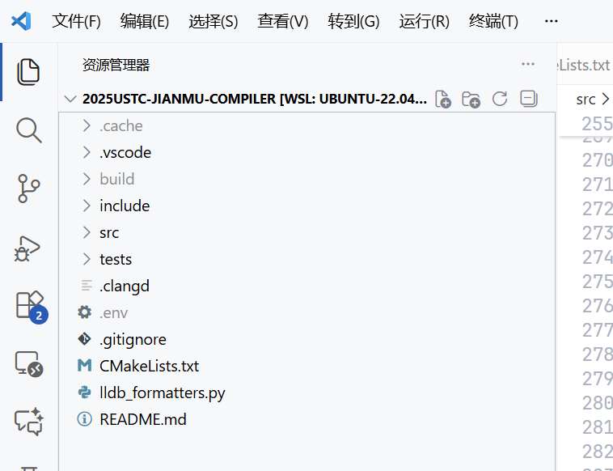
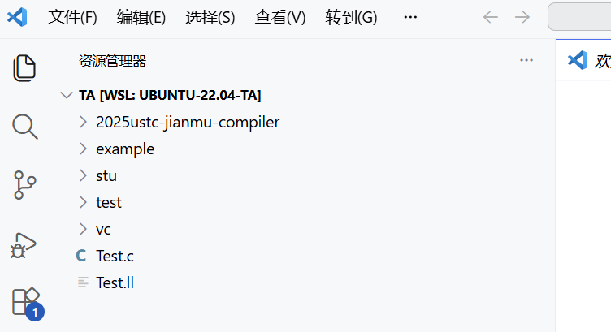
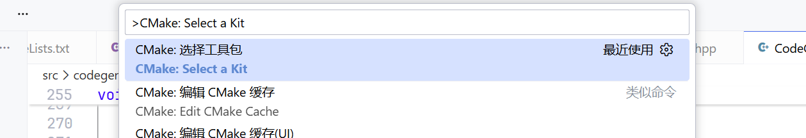
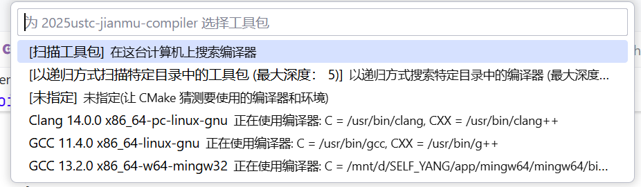
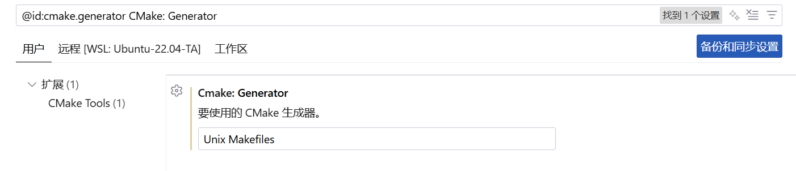
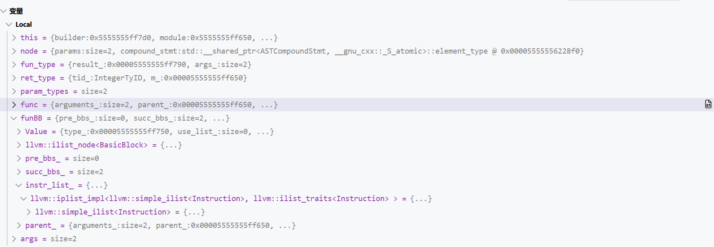
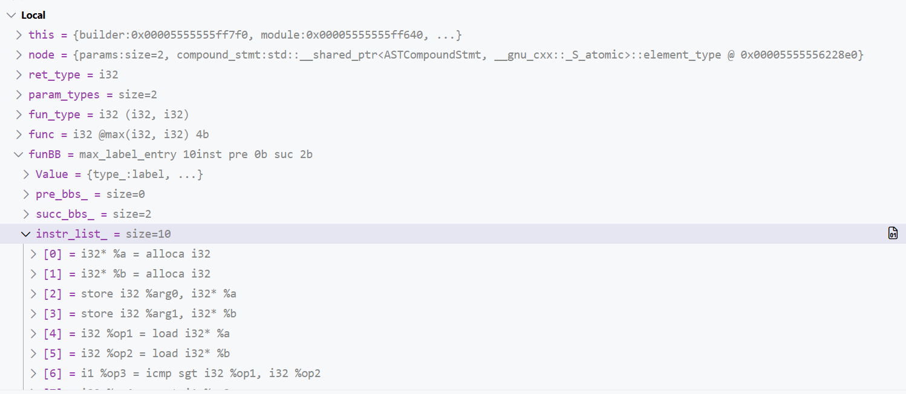
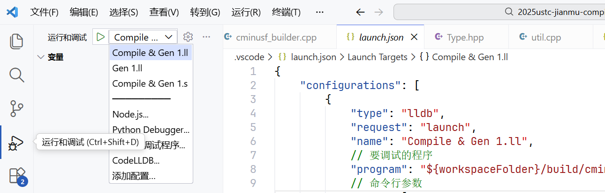
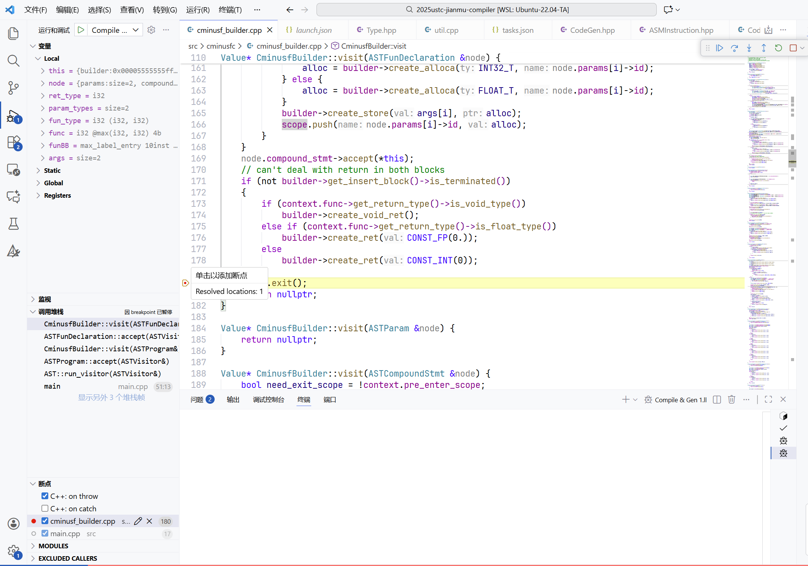

# 助教代码介绍

## 切换到助教代码

```bash
# 保存所有更改
git add *
git commit -m
# 拉取新更新
git pull upstream
# 切换分支
git checkout -b ta --track upstream/ta
```


然后手动复制你完成了的 Lab3 Phase2 代码到对应的文件夹（如果你做的是 Lab4 则不需要复制）。你可以先将 `CodeGen.cpp` 下载到本地，这样能够比对 `TODO` 并复制你的实验进度。
**注意只复制 TODO 部分**，复制整个文件将需要你手动修复大量代码错误。

!!! Note "下载 **CodeGen.cpp**" 

	在 VSCode 右键 `CodeGen.cpp`，点击 `下载`。

### 更改代码

由于实验框架的变动，你完成的代码中少量的代码（主要是 Light IR 相关的代码）需要更改，（如果没有开始 Lab3 Phase2，或你目前要做的是 Lab4，则不需要更改）主要是以下几个部分：

- `ASMInstruction::Atrribute` 需要重命名为 `ASMInstruction::Attribute`。
	- 你可以 `Ctrl + F` 唤出搜索栏，点击搜索栏最左边的箭头唤出替换栏，然后将 `Atrribute` 全部替换为 `Attribute`，因为这实际上是以前的框架拼错了。
- 使用 for 循环 `for(auto &i: bb)` 遍历基本块时，以前这里的 `i` 是 `BasicBlock`，现在是 `BasicBlock*`，因此它周围可能有智能提示报告错误，你需要去掉一些使用 `&` 取地址的操作，对这个错误进行修复。
	- 对 Instruction 也有同样的问题
	- 围绕 BasicBlock 和 Instruction 的报错基本上是因为这个


然后你可以编译你的代码，我们推荐使用 VSCode 运行 cmake，而非手动输入 `cmake ..`，因为后者捕捉不到 cmake 文件的变化。

### 编译代码

#### 打开仓库

确保 vscode 打开的文件夹是你的仓库，即



而不是



如果是后者，首先在命令行切换到仓库文件夹，然后输入 `code .` 打开一个新 VSCode 窗口

例如

```shell
yang@xxx:~/ta$ cd 2025ustc-jianmu-compiler/
yang@xxx:~/ta/2025ustc-jianmu-compiler$ code .
```

#### 使用 VSCode CMake

首先 `Ctrl + Shift + P` 调出命令窗口，输入 `Cmake: Select a Kit` 选择工具包

 

然后选择其中的 Clang



如果你发现只有扫描工具包选项，点击扫描工具包，然后再次 `Ctrl + Shift + P` 重复输入指令。

当你的 clang 实在无法通过编译或正常调试，可以使用 gcc，后者在与 lldb 协作调试时有一些问题，但不影响实验。
注意可能有多个 gcc 选项，若要进行 linux 调试，路径应该是 `/usr/bin/gcc` 而非其它路径。

现在可以运行 cmake，我们推荐使用 VSCode CMake 插件进行 CMake，而非命令行调用 `cmake ..`，你需要

- 删除 `build` 文件夹以刷新缓存
- 点进最外层的 `CMakeLists.txt` 文件，`Ctrl + S` 保存，它会自动配置 cmake

然后你可以在 `build` 文件夹进行 `make`。

???+ Note "Q&A" 

	`Ctrl + S` 没有配置 cmake?

	- `Ctrl + Shift + P` 输入指令 `CMake: Configure` 进行配置

	配置之后 make 报错显示没有指定目标?

	- 点击 VSCode 左下角设置，进行如下设置
	

若你使用命令行运行 cmake，仍然推荐你删除 `build` 文件夹以刷新缓存，你需要 cmake 命令行日志中注意使用的编译器确实是 clang。

## 使用 VSCode 进行调试

新框架的主要功能是与 CodeLLDB 集成的调试，例如同样断点，旧框架显示



新框架显示



为了进行调试，你首先需要创建 `launch.json`，助教代码中已经创建好，例如

```JSON
{
    "configurations": [
        {
            "type": "lldb",
            "request": "launch",
            "name": "Compile & Gen 1.ll",
            // 要调试的程序
            "program": "${workspaceFolder}/build/cminusfc",
            // 命令行参数
            "args": [
                "-emit-llvm",
                "./build/1.cminus",
                "-o",
                "./build/1.ll"
            ],
            // 程序运行的目录
            "cwd": "${workspaceFolder}",
            // 程序运行前运行的命令(例如 build)
            "preLaunchTask": "make cminusfc",
			// codelldb 集成
            "initCommands": [
                "command script import ${workspaceFolder}/lldb_formatters.py"
            ]
        }
	]
}
```

创建一个名为 `Compile & Gen 1.ll` 的调试选项，点击 VSCode 左侧调试栏，你可以找到所有你定义的选项



点击就可以进行调试。

上文这个选项实际运行了程序 `./build/cminusfc -emit-llvm ./build/1.cminus -o ./build/1.ll`，
在运行之前，由于设置了 `preLaunchTask`，还会取 `tasks.json` 里的对应指令，也就是每次都编译。

### 调试信息

若你不打断点，调试会很快结束（除非 assert 报错，程序会在 assert 停下来），你可以使用 assert 或者断点来停下来程序，例如下图在行号位置单击打断点。

打断点不一定停下来，特别是在函数返回时，有的编译器会停在 `return`，有的会停在函数结束的 `}` 处，你可以多打几个。



调试界面具有很多信息，右上角漂浮的窗口用于控制目前调试器的行为。这些图标作用分别为：

- 继续，从程序停止处开始执行，直到遇到下一个断点暂停或程序结束
- 逐过程，执行到下一行的位置停止，如果函数返回了就返回然后停住
- 单步调试，和下一步类似，但当你在函数调用上打了断点，"逐过程" 会执行到下一行，但是"单步调试"会进入调用的函数的第一行。
- 单步跳出，执行完当前的函数，然后暂停，当你点击"单步调试"进入函数后，单步跳出会执行完进入的函数并退出
- 重启，重新开始调试。
- 停止，停止调试，同时终止程序。

左侧的侧边栏拥有变量信息，包括

- `Local` 栏，具有调试程序暂停的时刻每个局部变量的值，暂停在类的内部还包含 `this`，单步跳出后还包含返回值
- `Static` 栏，包含暂停到的文件中的全局变量的值，暂停在不同的文件会显示不同的全局变量

下方具有堆栈和断点信息，包括

- 调用堆栈栏

例如下面代码

```c
void a() {
	int p = 2;
	b();
}
void b() {
	int t = 1;
	c();
}
void c() {
	int val = 0; // 断点停止处
}
```

停止在断点上后，调用堆栈从屏幕下往上依次是 `c`, `b`, `a`。如果你点击 `b`，页面就会导航到 `b` 进入 `c` 的地方，然后你可以查看局部变量 `c` 的值。

当程序运行出错，进入一些汇编代码时，调用堆栈告诉你它是如何执行到错误的地方，通过局部变量还可以判断具体是什么错误。

- 断点栏

显示你打了哪些断点，它们在哪里，以及你可以在这里暂时禁用它们。


### 调试变量

变量栏的变量以 `名称 + 描述` 对出现。

鼠标悬停在名称上，它可以显示变量的类型。鼠标悬停在描述上，它会将描述展开（如果页面太短了看不到描述）。

点击某个变量，你就可以看到它的成员。特别的，如果 `class A : B`，你展开 `A` 能看到一个 `B`，它是 `A` 中包含的父类信息。


???+ Note "Q&A" 

	调试窗口变量的描述与文档中的图片不同，非常复杂难以阅读?

	这可能是由于 lldb 没有正常工作。

	在命令行输入 `lldb` 回车，若显示 `ModuleNotFoundError: No module named 'lldb.embedded_interpreter'`，可能就是这个问题。这是 lldb 的一个 bug，原因是 llvm 需要使用它自带的 python 文件，但是它设置错了自己的默认 python 路径。

	输入 `exit` 退出刚才的环境，输入 `lldb -P`，会显示 llvm 默认 python 路径，例如 `/usr/lib/local/lib/python3.10/dist-packages`。这个 python 路径也许不存在，你需要创建 `/usr/lib/local/lib/python3.10` 文件夹。

	然后你需要寻找 llvm 自带的 python，它一般在 `/usr/lib/llvm-14/lib/python3.10/dist-packages`，然后将它链接到 llvm 默认路径，这里即 `sudo ln -s /usr/lib/llvm-14/lib/python3.10/dist-packages /usr/lib/local/lib/python3.10/dist-packages`。

	不同的机器可能具有不同的路径。


