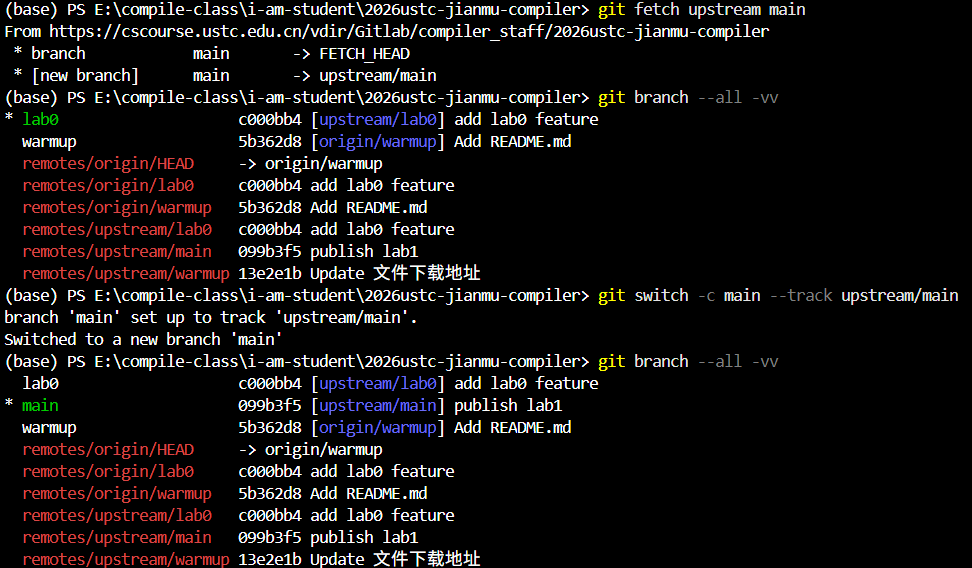

# Lab1 简介

本次实验需要同学们从无到有完成一个完整的 Cminusf 解析器，包括基于 Flex 的词法分析器和基于 Bison 的语法分析器，并将得到的语法分析树转化成抽象语法树（AST）。

## 文档

本次实验提供了若干文档，请根据实验进度和个人需要认真阅读。

- [正则表达式](./正则表达式.md)
- [Flex](./Flex.md)
- [Bison](./Bison.md)
- [词法语法解析](词法语法解析.md)
- [AST](./AST.md)
- [AST 生成](AST生成.md)

## 实验内容

本次实验需要分阶段完成及验收。

### 阶段一

内容一：阅读[正则表达式](./正则表达式.md)、[Flex](./Flex.md)、[Bison](./Bison.md) 掌握基础知识，并 **回答每个文档内的思考题**，回答内容保存为 `answer.pdf`。

内容二：阅读[词法语法解析](词法语法解析.md)，完成词法分析器与语法分析器并生成语法分析树（syntax_tree）。

!!! warning "Deadline"

    **2026 年 10 月 3 日 23:59**

### 阶段二

内容一：阅读[AST](./AST.md)，掌握由语法分析树向抽象语法树的转换逻辑。

内容二：阅读[AST 生成](AST生成.md)，完成抽象语法树（AST）的构建。

!!! warning "Deadline"

    **2026 年 10 月 10 日 23:59**

## 实验要求

!!! Warning "请务必先 fork 后拉取最新的实验仓库"

    请使用自己 fork 后的仓库完成今后的实验！

请根据 Lab0 的内容，将[实验仓库](https://cscourse.ustc.edu.cn/vdir/Gitlab/compiler_staff/2026ustc-jianmu-compiler) <font color="red">**fork**</font> 并 clone 到本地，并将实验仓库设置为上游仓库。已经 clone 过的同学只需要拉取最新内容即可。

```bash

# 进入你自己的本地实验仓库目录
cd 2026ustc-jianmu-compiler
git fetch upstream main
git switch -c main --track upstream/main

# 在你完成 TODO 后

git push origin main

```

   


## 提交内容

- 在希冀平台提交你实验仓库的 url（如 `https://cscourse.ustc.edu.cn/vdir/Gitlab/PB24xxx/2026ustc-jianmu-compiler.git main`）。
    - 注意: url 后空格加上分支名!!!
- 在希冀平台提交你的 `answer.pdf` 文件，其中包含：
    - [正则表达式](./正则表达式.md#思考题)
    - [Flex](./Flex.md#思考题)
    - [Bison](./Bison.md#思考题)

## 写在前面

助教推荐同学们在自己的 VS Code 中安装 TODO 高亮扩展，它可以帮助你在完成实验时更快地找到需要补充代码的部分；你还可以对这个扩展进行自定义，例如高亮的颜色、高亮的关键词等。

   

