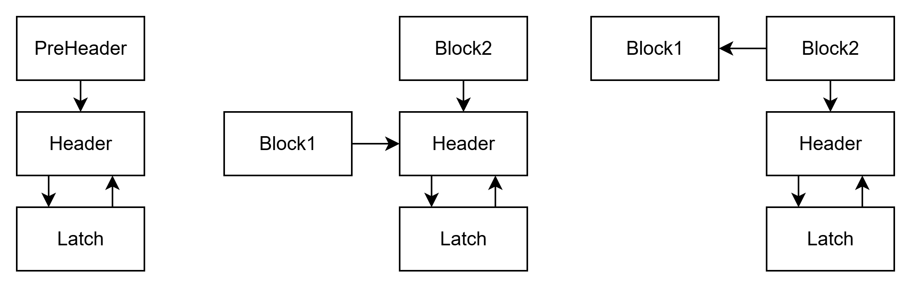
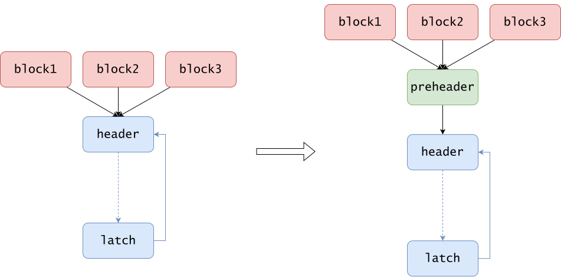

# LICM

## 循环不变代码外提介绍

循环不变代码外提（**L**oop **I**nvariant **C**ode **M**otion，**LICM**）是编译器优化中的一种重要技术，它通过识别和移动循环中的不变操作来提高程序性能。当一个计算操作的结果在整个循环执行过程中保持不变时，我们就可以将这个操作移到循环之外执行，这样就能避免在每次循环迭代中重复执行相同的计算。

假设有如下代码（除了循环体和寻址，其余变量保持静态单赋值，以与 IR 对应）

```cpp
int n = random_input();
int i = 0;
while (i < n) {
    int x1 = y + z;
	int x2 = log3(log3(log3(x1)));
	int x3 = i + x2;
	a[i] = x3;
	b[0] = x2;
	i = i + 1;
}
```

在这段代码中，`int x1 = y + z` 和 `int x2 = log3(log3(log3(x1)))` 是循环不变的，因为它们的值在整个循环执行过程中保持不变。因此，我们可以将这个操作移到循环之外执行，减少循环内的计算量。

```cpp
int n = random_input();
int i = 0;
int x1 = y + z;
int x2 = log3(log3(log3(x1)));
while (i < n) {
	int x3 = i + x2;
	a[i] = x3;
	b[0] = x2;
	i = i + 1;
}
```

但这并不总是会优化性能，例如如果 `n` 在大部分时候等于 0，这个循环即使不会执行，也还是要把 `x1` 和 `x2` 计算出来。

可以对它的性能进行定量分析，假设所有操作只有 `log3(log3(log3(x1)))` 是耗时的，它的耗时记为 `1`，我们 4 次执行程序，并对耗时取平均值：

|输入 `n` 序列|未外提平均耗时|外提平均耗时|
|---|---|---|
|`0, 0, 0, 0`| `0`| `1`|
|`1, 0, 0, 0`| `0.25`|`1`|
|`2, 1, 2, 0`| `1.25`| `1`|
|`1, 2, 3, 4`| `2.5`| `1`|

显然，程序有时变快有时变慢。一般的循环大部分时候输入 `n` 都非 0，所以大部分情况都是变快。

我们可以通过在代码外层套一层 `if` 判断是否会执行循环，再把 `while` 变成 `do while` 的方式来解决这个问题：

```cpp
int n = random_input();
int i = 0;
if(i < n) { // loop guard
	do {
    	int x1 = y + z;
		int x2 = log3(log3(log3(x1)));
		int x3 = i + x2;
		a[i] = x3;
		b[0] = x2;
		i = i + 1;
	} while (i < n)
}
```

这一过程被称之为 [Loop Rotate](https://llvm.org/docs/Passes.html#passes-loop-rotate)，我们在本次实验中不要求实现。

在进行 Loop Rotate 后，我们可以进行无负优化的外提，并且还能将 `b[0] = x2` 一起外提出去
```cpp
int n = random_input();
int i = 0;
if(i < n) { // loop guard
    int x1 = y + z;
	int x2 = log3(log3(log3(x1)));
	do {
		int x3 = i + x2;
		a[i] = x3;
		i = i + 1;
	} while (i < n)
	b[0] = x2;
}
```

## 如何识别循环不变量？

Light IR 是静态单赋值形式，意味着：

- 单赋值，一个变量只被赋值一次，赋值后值不变

- 静态，只在编译阶段是单赋值，在执行阶段，循环中每次执行值都会变化

而我们所寻找的循环不变量，是即使在执行时两次经过循环，值也不会发生变化的变量。

循环不变量中最显然的是循环外的变量，例如下图中的 `y` 和 `z`：

```cpp
int n = random_input();
int i = 0;
while (i < n) {
    int x1 = y + z;
	int x2 = log3(log3(log3(x1)));
	int x3 = i + x2;
	a[i] = x3;
	b[0] = x2;
	i = i + 1;
}
```

显然操作数都是循环不变量，而又没有副作用（例如 load/store）的指令也是循环不变量。

我们逐句检查循环中每条指令：

- `x1 = y + z` 操作数只有 `y` 和 `z`，它是一个循环不变量。
- `x2 = log3(log3(log3(x1)))`，操作数只有 `x1`，其中调用的函数 `log3` 是一个纯函数（意味着无副作用），它也是循环不变量。
- `x3 = i + x2` 包含一个 `i`，每次循环都会变，因此它不是循环不变量

上面这种操作方式启发我们使用如下算法：

- 收集循环中的所有指令，放到集合 `insts` 中

- 准备两个集合， `variant` 放置在每次循环一定会变化变量，`invariant` 放置每次循环都不变的不变量

- 扫描 `insts` 中每个指令
	- 如果这个指令有副作用，将它从 `insts` 放进 `variant`，这包括
		- 它是 `phi`，即使可以外提也非常麻烦，需要更改每个操作数，所以干脆当成变量不外提
		- 它是 `alloca`，如果你在循环中发现了 `alloca`，代表你的 `lab2` 写得有问题
		- 它是 `ret` 或 `br`，不能外提
		- 它是 `store`，外提后还需要 Loop Rotate 保证程序正确，因此不外提
		- 它是 `load`，不知道两次循环 `load` 出来的值是不是一样，所以不外提
		- 它是 `call`，并且调用的不是纯函数，因此函数内部可能会进行类似 `load` 和 `store` 的操作，不外提
	- 如果这个指令没有副作用
		- 如果它的操作数要么在 `invariant` 里，要么在循环外，说明它的操作数都是循环不变量，那它自身也应该是循环不变量，将它从 `insts` 放入 `invariant`。
		- 如果它有在 `variant` 中的操作数，说明它依赖于一个循环中的变量，它自身也就是变量，从 `insts` 放入 `variant`
		- 如果操作数全在 `insts` 中，说明还不能决定它是变量还是不变量，把它留在 `insts` 里，先扫描下一条指令

- 不断扫描 `insts` 重复上述操作，直到 `insts` 为空

这样，`invariant` 中就包含了所有的需要外提的循环不变量。

## 处理 Load

我们以前的算法假设所有的 `load` 都不能外提，但是显然，在下面指令中的 `b[0]` 是可以外提的。因为在整个循环都没有对 `b` 进行 `store`，`load` 出来的值不会发生变化。

```cpp
int n = random_input();
int i = 0;
while (i < n) {
    int x1 = b[0];
	int x3 = a[0];
	int x4 = x1 + x3;
	a[i] = x2;
	i = i + 1;
}
```

识别这种可以外提的 `load` （即在循环中没有被 `store` 过的变量的 `load`）具有两个挑战

- `load` 和 `store` 的指针通常来自于 `getelementptr`，如何知道一对 `load` 和 `store` 是不是操作同一变量？
- 代码中存在一些非纯函数的调用，如何知道这些函数调用是否 `store` 了我们希望 `load` 的变量？

助教在此提供了 FuncInfo Pass 用于解决这些问题，这个 Pass 不要求同学们实现，如果你感兴趣，你可以看看它是如何实现的。

### FuncInfo

FuncInfo Pass 用于获得函数的信息，一般包括计算每个函数是否是纯函数。基于 Light IR 的一些特点，可以使 FuncInfo 提供每个函数 `store` 和 `load` 了哪些变量的信息。

我们的 `cminus_builder` 在运行完 `Mem2Reg` 和 `DeadCode` 后，提供的 IR 满足

- 指针不会被存入内存中
	- IR 中唯一会将指针存入内存的地方是函数调用时传入 `int[]`，它会被存入 `alloca i32*` 中，然而 `alloca i32*` 会被 `Mem2Reg` 消除

- 指针不会出现在 phi，这是由于没有指针赋值，例如下面这个

	- ```c++
		int a[10];
		int b[10];
		int* c;
		if(xxx) c = &a[0];
		else c = &b[0];
		```

所以如果对某个 `load/store` 操作的指针 `%p` 进行溯源：

- 令 `src = %p`

- 反复执行：若 `src == getelementptr %p1`，令 `src = %p1`

你就能得到 `load/store` 操作的指针来源，它要么是一个全局变量，要么是局部的数组变量 `alloca`，要么是函数参数中传入的指针形参变量 `argument`。

FuncInfo 通过这些分析，提供了一组 api:

```
FuncInfo::is_pure(Function*) 函数是否是纯函数，非纯函数不能外提

FuncInfo::store_ptr(StoreInst*) StoreInst 存入的变量

FuncInfo::load_ptr(LoadInst*) LoadInst 加载的变量

FuncInfo::get_stores(CallInst*) CallInst 直接或间接 store 了的所有变量
```

### 处理 Load

在进行不变量识别前，首先扫描一遍循环中的所有指令，通过 `FuncInfo::store_ptr` 和 `FuncInfo::get_stores(CallInst*)` 收集循环中被 `store` 过的变量集合。

现在开始进行不变量识别。如果发现遇到的 `load` 指令加载的变量（通过 `load_ptr` 得到）没有被 `store` 过，它就可以外提。

## 处理 Call

一些函数非纯函数调用也可以进行外提，例如
```CPP
int N;
void func(int a)
{
	return a + N;
}
```

假如 `N` 只会被在程序开始赋值一次，其它时候实际上是个常量，这个函数完全可以当成类似纯函数来看待。

## 如何进行外提？

在识别出了循环不变量后，我们还要考虑如何将这些循环不变量外提。这似乎是一件简单的问题，我们只需要将循环不变的指令 **按照顺序** 移动到循环之前即可。



左图中，我们将指令放入 Header 之前的基本块，也就是循环的 PreHeader；在中图，这样的基本块有两个，由于我们的 IR 是静态单赋值形式，指令不能同时放入两个基本块，因此就找不到放置指令的位置；在右图，虽然可以放入 Block2，但这导致即使不进入循环也会执行我们外提的指令。

这一切要求为循环创建一个 **PreHeader** 基本块作为不变量的外提插入点。循环的 **PreHeader** 满足以下要求：

- PreHeader 只有 Header 一个后继
- Header 只有 PreHeader 一个前驱

如果已经像左图一样存在这样的基本块，就可以直接拿它作为 PreHeader，如果不存在，就需要在 Header 前面创建一个 PreHeader 块，并且将 Header 原来前驱的跳转都指向 PreHeader。



## 为 PreHeader 维护 Phi

PreHeader 的插入将导致 Header 块的 Phi 被破坏，以上图为例，假设 Header 具有指令 `%a = phi [%b1, block1], [%b2, block2], [%b3, block3], [%b4, latch]`，那么它需要被分裂成

- 一条在 PreHeader 的指令 `%ap = phi [%b1, block1], [%b2, block2], [%b3, block3]`
- 一条在 Header 原有位置的指令 `%p = phi [%ap, preheader], [%b4, latch]`

好在外提的指令不会依赖这些指令，因此不需要更改，你可以简单的把它们从指令列表中移除，然后添加到 preheader 中。

## 代码撰写

1. 补全 `src/passes/LICM.cpp` 文件，使编译器能够正确执行循环不变量外提。

## 本地测试

### 测试脚本

`tests/4-opt` 目录的结构如下：

```
.
├── eval_lab4.cpp
└── testcases
    └── ...
```

当运行 `sudo make install` 后，你可以直接使用 `eval_lab4 all testcases debug` 进行测试，或者将 `all` 换成 `raw`，`mem2reg`，`licm` 来测试不同阶段，其中 `raw` 代表不加任何优化。

运行结果类似于

```
==========6_complex4.cminus==============
raw      OK Take Time (us): 1088  Inst Execute Cost: 428 Allocate Size (bytes): 1188
mem2reg  OK Take Time (us): 829   Inst Execute Cost: 428 Allocate Size (bytes): 60
licm     OK Take Time (us): 857   Inst Execute Cost: 406 Allocate Size (bytes): 60
```

由于后端使用栈式分配，并且需要进行额外的统计工作，可能时间上不会体现出很明显的优化。我们提供了 Inst Execute Cost 指标，代表程序中特定类型指令的执行次数。

LICM 将指令提到循环外，所以大部分时候会降低这个次数，所以可以认为次数越低效果越好。


## 编译与运行

按照如下示例进行项目编译：

```shell
$ cd 2025ustc-jianmu-compiler
$ mkdir build
$ cd build
# 使用 cmake 生成 makefile 等文件
$ cmake ..
# 使用 make 进行编译，指定 install 以正确测试
$ sudo make install
```

现在你可以 `-licm` 使用来指定开启 LICM 优化：

- 将 `test.cminus` 编译到 IR：`cminusfc -emit-llvm -mem2reg -licm test.cminus`
- 将 `test.cminus` 编译到汇编（还会附带一个 IR）：`cminusfc -S -mem2reg -licm test.cminus`
