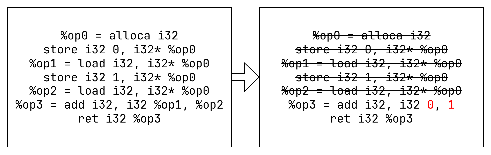
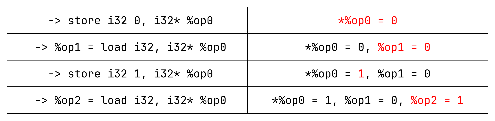
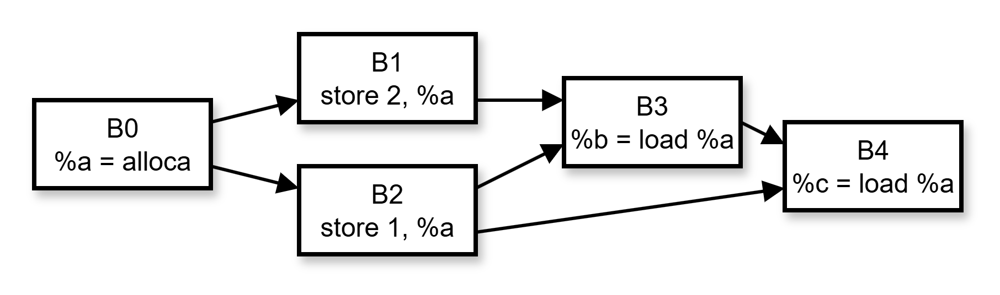
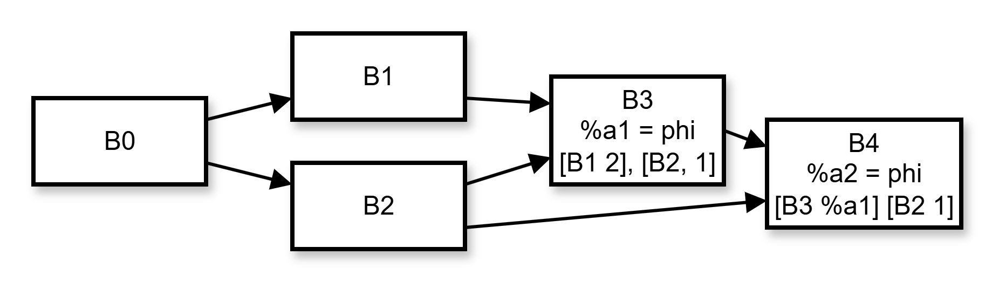
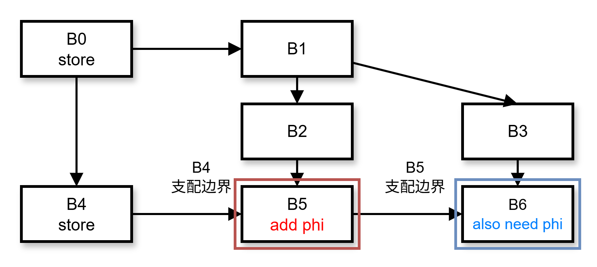
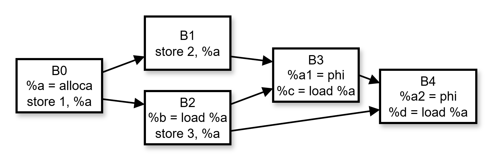
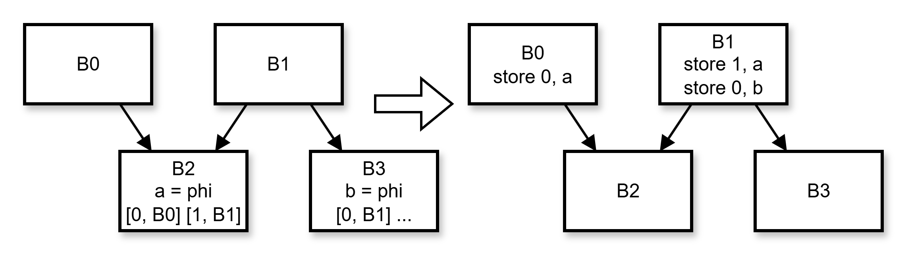
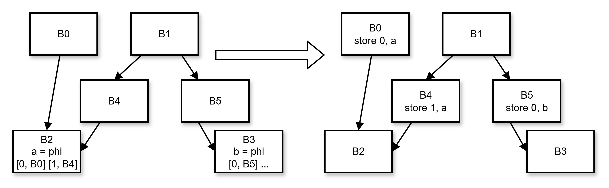

# Mem2Reg

Mem2Reg（Memory to Register Promotion）是一个重要的优化过程，它的主要目标是将内存访问转换为寄存器操作，从而提高程序的执行效率。这个优化过程主要处理程序中的局部变量，特别是那些分配在栈上的变量，将它们转换为 SSA（Static Single Assignment）形式的寄存器值。

在未经优化的代码中，编译器往往会将局部变量放置在栈内存中，这导致每次访问变量时都需要执行内存加载和存储操作。这种方式虽然实现简单且容易理解，但从性能角度来看并不理想，因为内存访问的开销远大于寄存器访问。Mem2Reg 优化正是通过识别这些可以安全转换的内存操作，将它们替换为更高效的寄存器操作。

Mem2Reg 的工作过程通常包含多个步骤。首先，它需要识别哪些内存位置是可被转换的。这些内存位置通常是通过 alloca 指令分配的局部变量。然后，它会分析这些变量的使用模式，包括所有的加载和存储操作。在此基础上，优化器会构建必要的 phi 节点，确保在控制流汇合点正确处理变量的多个可能值。最后，它将内存操作替换为对应的寄存器操作，并建立适当的 SSA 形式。

这个优化过程不仅能直接提升程序性能，还能为后续的优化创造更多机会。例如，当变量被提升到寄存器后，其他优化如常量传播、死代码消除等就能更容易地识别和处理这些值。此外，由于 SSA 形式提供了更清晰的数据流信息，这也有助于编译器进行更准确的分析和更激进的优化。

## 算法介绍

### 阅读和学习

你可以阅读 [Mem2Reg 介绍](./Mem2Reg介绍.pdf)，了解 Mem2Reg 的基本原理。下面只会介绍 Mem2Reg 的算法具体实现。

### Mem2Reg 工作效果

Mem2Reg 会消除所有的非数组 `alloca`，以及它相关的 `load` 和 `store`，例如下面



可以将 `%op0` 消去，这是因为当执行 `%op1 = load i32, i32* %op0` 时，我们知道在 `%op0` 中存储的 `0`，所以可以直接拿 `0` 替换 `%op1`，同理可以拿 `1` 替换 `%op2`。


以下变量的 `load` 和 `store` 不受 Mem2Reg 影响

- 全局变量，因为存储的值在函数外可能会用到
- 函数参数中的 `i32*`，也是存储的值在函数外可能会用到
- `alloca` 分配的数组，因为每次存取数组哪个部分并不确定
	- 例如 `a = b[c]`，因为 `c` 不是一个定值，不能知道上次存到 `b[c]` 的值是什么

当正确运行 Mem2Reg 后，程序中所有的 `alloca` 分配的都是数组。

### 单基本块的转换


为了描述方便，下面假设所有 `alloca` 都分配非数组，并且所有 `load` 和 `store` 都存取这些 `alloca` 变量，这样 Mem2Reg 会将它们全部消去。我们称这些 `alloca` 变量为临时变量。

我们以上面的图为例，我们创建两个 `map`，第一个保留临时变量与它目前的值的映射，在 `store` 时进行修改；第二个保留每个 `load` 指令到它读取到的值的映射。

算法运行过程如下



现在我们得到 `%op1 = 0, %op2 = 1`，它们替换 `%op1` 和 `%op2`，就得到了消除了所有 `load` 和 `store` 的代码（原来的 `%op1 = load` 在全部替换完之后删掉）。我们把这个替换的过程叫做 `rename`。

### 多基本块的转换



当具有不同基本块，就无法每个基本块分别执行 `rename`。例如图中 `%b = load %a` 读出来的值可能是 `1` 也可能是 `2`（取决于执行路径），在编译时我们无从得知执行路径，所以 `%b` 既不能被替换为 `1`，也不能替换为 `2`。

不过我们可以在 `B3` 中插入 `%a1 = phi [B1 1], [B2 2]`，这样就能把 `%b` 替换为 `%a1` 了，对于 `B4` 同理。



通常这意味着对局部变量进行替换前需要先插入 `phi` 指令

### 插入 phi 指令

这也是我们算法实现的第一步。

插入 `phi` 的目的是使每个 `load` 都能被替换为一个 ir 中定义过的变量。

假如在基本块 `A` 具有指令 `store %n, %a`，并且所有 `A` 支配的基本块都没有对 `%a` 的 `store` 指令，那么这些基本块中的 `load %a` 可以全部被换成 `%n`，显然不需要插入 `phi` 指令。

但是在 `A` 的支配边界 `B` 情况不太一样。程序执行到 `B` 时可能经过 `A` 也可能不经过 `A`，所以执行 `B` 时 `%a` 存储的值可能是 `%n` 也可能不是 `%n`，所以这里需要一个 `phi` 指令。

这样我们得到，我们需要在所有 `store` 指令所在基本块所在的支配边界上插入 `phi`。这样尚且还不能满足需求，我们插入的 `phi` 在其基本块的支配边界又会遇到上面一样的问题，所以需要再次在支配边界插入 `phi`，例如下图：



向上面这样反复插入 `phi` 直到程序稳定（已经插入过的基本块无需重新插入），最后得到的程序在任何地方都能找到用来替换 `load` 的值。（我们假设了所有 `A` 支配的基本块都没有 `store`，但可以证明即使有，这个插入 `phi` 的方法也有用）。

这一步骤已经由助教实现，注意
- 所有的 `phi` 都没有添加参数，需要在后序添加参数。
- 上面所说插入 `phi` 的过程只针对单个局部变量，不同局部变量需要单独插入

### 执行 rename

Rename 需要对每个基本块执行，在我们的实现中，Rename 首先操作入口块，然后按照支配树进行深度优先搜索处理其它基本块。Rename 进行的操作基本上类似 [单基本块的转换](Mem2Reg.md/#单基本块的转换)。


在 [单基本块的转换](Mem2Reg.md/#单基本块的转换) 中，我们创建两个 `map`，第一个保留临时变量与它目前的值的映射，在 `store` 时进行修改（我们叫做 `value`）；第二个保留每个 `load` 指令到它读取到的值的映射（我们叫做 `replace`）。这样虽然可以处理单基本块的情况，但是对于多基本块有两个问题：

- 如何在基本块间切换
- 如何处理上一步插入的 phi 指令



想象你从图中 B1 到 B2

- 处理 B1 `store 2, %a`，设置 `value[a] = 2`。
- 处理 B2 `%b = load %a`，设置 `replace[b]( = value[a]) = 2`。

显然 `replace[b]` 应该是 `1`，跨基本块使算法产生了错误。

为解决这个问题，将 `value` 的类型从 `map<Value*, Value*>` 改为 `map<Value*, stack<Value*>>`。

- 当进入基本块，执行 `value[a].push(value[a].top())`
- 当遇到 `store 2, %a`，执行 `value[a].top() = 2`
- 当退出基本块，执行 `value[a].pop()`
- 当遇到 `%b = load %a`，执行 `replace[b] = value[a].top()`

这样 `value` 表就保存了临时变量在每个基本块结束时最后的值，不会因为在基本块间切换而出错。

我们还需要处理添加的 `phi` 指令

- 添加的 `phi` 指令的操作数目前还是空的
- 需要决定遇到 `phi` 时如何更改 `value` 和 `replace` 表

对于后者，由于 `phi` 指示了目前临时变量中存储的值，它的作用和 `store` 指令类似，在遇到 `%a1 = phi` 时，同样执行 `value[a].top() = a1`。

对于前者，由于 `phi` 的操作数为 \[前驱块，前驱块最后局部变量存储的值\] 的形式，所以我们可以在退出基本块前把 `value` 栈顶的值添加到后继块 `phi` 的操作数中。

现在你拥有了

- 所有需要替换的 `load` 指令需要被替换成的值，它们存储在 `replace` 中
- 所有需要删除的局部变量，它们是 `value` 表的键
- 一个 rename 的框架

```
rename(BasicBlock* bb)
{
	// 对每个局部变量 a，value[a].push(value[a].top())

	// 遍历基本块所有指令
	// - 当遇到 store k, a，执行 value[a].top() = k
	// - 当遇到 b = load a，执行 replace[b] = value[a].top()
	
	// 给每个后序基本块中 phi 添加参数，对于处理 a 的 phi，添加 [bb, value[a].top()]

	// 对支配树上 bb 的所有孩子 bn，执行 rename[bn]

	// 对每个局部变量 a，执行 value[a].pop()
}
```

由于**指令只会在同一基本块的后面或者被其所属基本块支配的基本块中用到**，我们按照支配树的顺序进行遍历，可以让我们把替换和删除变量集成在 rename 过程中

```
rename(BasicBlock* bb)
{
	// 对每个局部变量 a，value[a].push(value[a].top())

	// 遍历基本块所有指令，并标记需要删除的 load/store/alloca 指令
	// - 当遇到 store k, a，执行 value[a].top() = k
	// - 当遇到 b = load a，执行 replace[b] = value[a].top()，将所有 b 的使用替换为 replace[b]
	
	// 给每个后序基本块中 phi 添加参数，对于处理 a 的 phi，添加 [bb, value[a].top()]

	// 对支配树上 bb 的所有孩子 bn，执行 rename[bn]
	
	// 对每个局部变量 a，执行 value[a].pop()

	// 删除标记需要删除的指令
}
```

## 在 CodeGen 中处理 Phi

我们 CodeGen 使用的 `phi` 翻译方法已经由助教编写，由于栈式分配会给每个变量（包括 `phi`）分配一个栈空间，只需要在基本块末尾将值存入后序块的 `phi` 对应栈空间。



注意到 `B1`，它执行了一次错误 `store`（因为要么往 B2 修改 `a`, 要么往 B3 修改 `b`），但是因为是栈式分配它仍然正确。

如果是寄存器分配，为了保证正确性，就必须保证 `phi` 的翻译不存在错误的 `store` 操作（在寄存器分配中是 `copy` 操作）。

我们仍以上面的图举例，该图的基本块结构无论如何都无法完成任务，所以基本块间关系必须进行修改，这通常是通过消除**关键边** 来完成的（关键边是源有多个后继，目标有多个前驱的边）。

上图消除关键边得到



## 实验任务

### 代码撰写

1. 补全 `src/passes/Mem2Reg.cpp` 文件，使编译器能够正确执行 Mem2Reg

### 测试脚本

`tests/4-opt` 目录的结构如下：

```
.
├── eval_lab4.cpp
└── testcases
    └── ...
```

当运行 `sudo make install` 后，你可以在 `4-opt` 目录直接使用 `eval_lab4 all ./testcases debug` 进行测试，或者将 `all` 换成 `raw`，`mem2reg`，`licm` 来测试不同阶段，其中 `raw` 代表不加任何优化。

运行结果类似于

```
==========6_complex4.cminus==============
raw      OK Take Time (us): 1088  Inst Execute Cost: 428 Allocate Size (bytes): 1188
mem2reg  OK Take Time (us): 829   Inst Execute Cost: 428 Allocate Size (bytes): 60
licm     OK Take Time (us): 857   Inst Execute Cost: 406 Allocate Size (bytes): 60
```

由于后端使用栈式分配，并且需要进行额外的统计工作，可能时间上不会体现出很明显的优化。我们提供了 Allocate Size (bytes) 指标，代表程序中 Allocate 分配的栈大小。

Mem2Reg 会消除栈变量，将它变成寄存器变量。 可以认为  Allocate Size 越小 Mem2Reg 效果越好。

## 编译与运行

按照如下示例进行项目编译：

```shell
$ cd 2025ustc-jianmu-compiler
$ mkdir build
$ cd build
# 使用 cmake 生成 makefile 等文件
$ cmake ..
# 使用 make 进行编译，指定 install 以正确测试
$ sudo make install
```

现在你可以 `-mem2reg` 使用来指定开启 Mem2Reg 优化：

- 将 `test.cminus` 编译到 IR：`cminusfc -emit-llvm -mem2reg test.cminus`
- 将 `test.cminus` 编译到汇编（还会附带一个 IR）：`cminusfc -S -mem2reg test.cminus`
