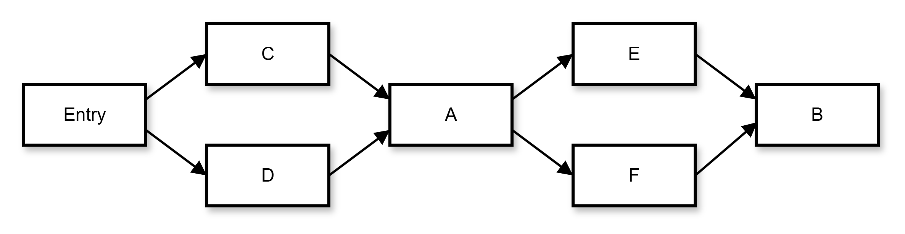
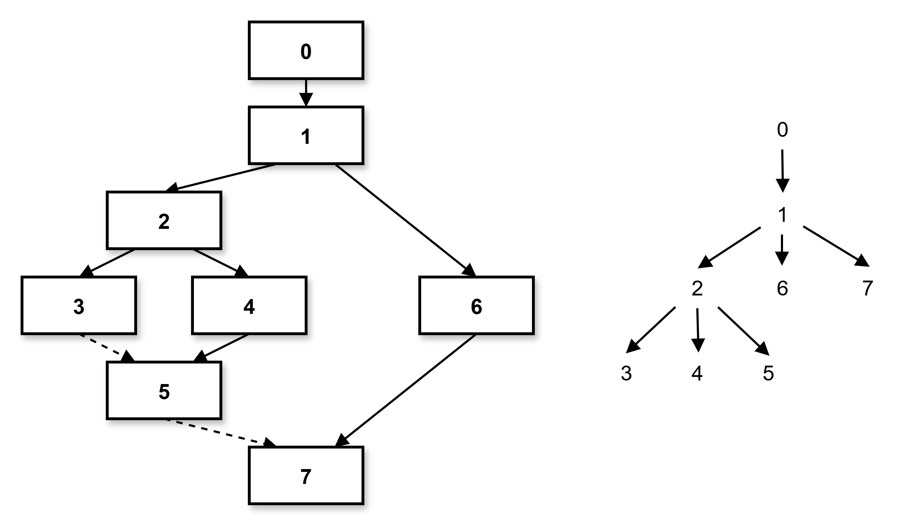
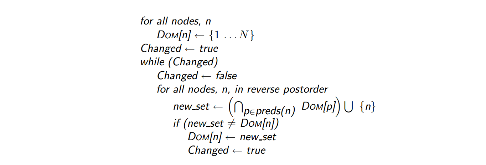
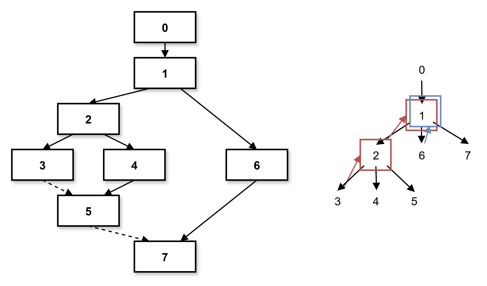
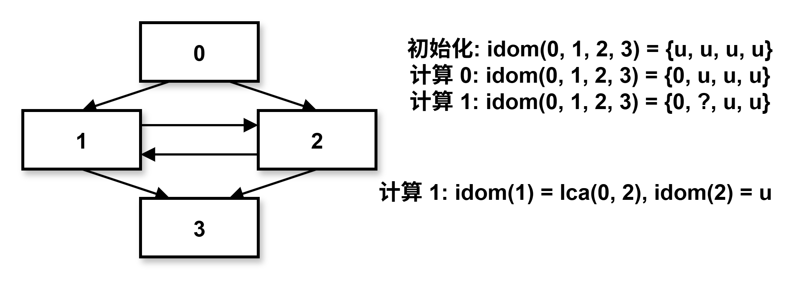
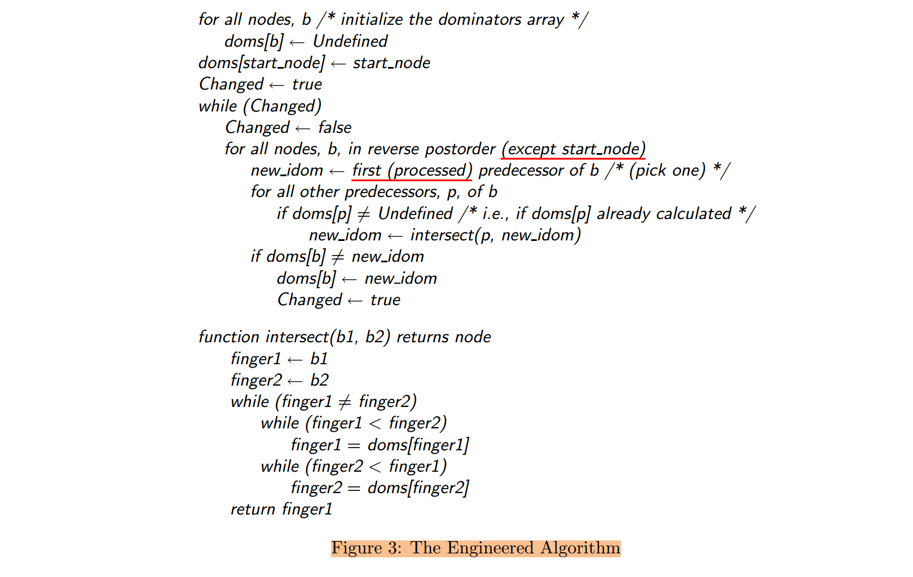
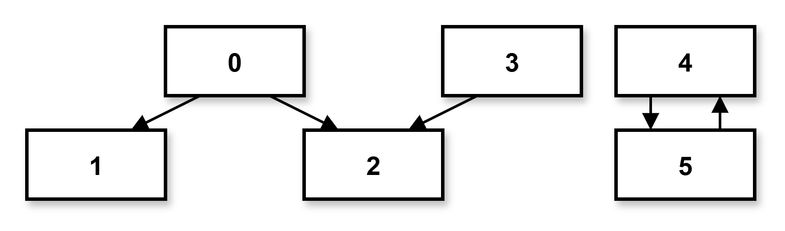
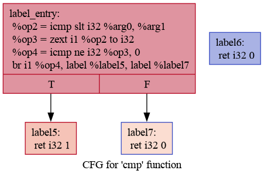

# Dominators

为了实现 Mem2Reg, LoopDetection 以及 LICM, 我们需要先实现 Dominators 支配树分析。

在课上已经对支配树进行了一定介绍 ([相关课件](../ppt/Lecture31-Loop-part1.pdf))。
我们实际上使用的并非课件上的方法, 而是[A Simple, Fast Dominance Algorithm](Dom.pdf)。

在此对相关概念与求解算法进行介绍。

## 算法介绍

### 支配关系

节点 $A$ 支配节点 $B$(或 $A$ 是 $B$ 的支配节点), 是指从入口节点 $Entry$ 到达节点 $B$ 的每条路径一定会经过 $A$。我们将 $A$ 支配 $B$ 写为 $A\ dom\ B$。

特别的，我们认为 $A$ 支配 $A$ 自身。



### 直接支配节点和支配树

可以证明, 如果 $M$ 支配 $B$ 且 $N$ 支配 $B$, 那么要么 $M$ 支配 $N$, 要么 $N$ 支配 $M$。

这样我们可以定义直接支配:

> $A$ 直接支配 $B$, 当且仅当 $A$ 支配 $B$, $A \ne B$, 并且任意支配 $B$ 的非 $B$ 节点都支配 $A$. 这记作 $A\ idom\ B$.

直观上 $B$ 的直接支配节点就是离 $B$ 最近支配 $B$ 的节点. 从 $Entry$ 可达的节点中, 只有 $Entry$ 没有直接支配节点。

将每个节点的直接支配节点作为它的 parent 节点, 我们就能得到一个支配树, 它以 $Entry$ 为根:




在这颗树上, 节点支配以它为根子树的所有节点, 直接支配它的孩子节点.

### 支配边界

直观上来说, $A$ 的支配边界就是它刚好支配不到的节点。即不被 $A$ 支配, 但有 $A$ 所支配节点作为前驱的节点集(并不需要所有前驱都被 $A$ 支配)。

### 朴素支配节点集计算方法

我们需要求解 $n$ 的支配节点集合 $DOM(n)$, 也就是从 $entry$ 到 $n$ 一定会经过的所有节点.

直观上来说, 从 $entry$ 到 $n$ 必须先经过 $n$ 的所有前驱, 所以到 $n$ 必经节点是到其不同前驱必经节点的交集。这体现为下面的数据流方程

$$
DOM(n) = \left(\bigcap_{p \in preds(n)}DOM(p) \right) \cup \{n\}
$$

可以通过数据流迭代来求解。迭代开始, 所有节点的支配节点集合都被设置为全集，迭代按照逆后序进行以获得最大效率。

这个算法的伪代码是




### A Simple, Fast Dominance Algorithm

这也是我们实验中采用的方法。

注意到 $DOM(n)$ 恰好是支配树上 $n$ 的所有祖先节点加上它自己, 只要能够画出支配树, 就能够知道每个节点的支配节点集合。

为了画出支配树, 最简单的方法是求出每个节点的直接支配节点 (因为它是树中的 parent 节点)。

这可以分情况讨论

- 如果 $n$ 只有一个前驱, $n$ 的直接支配节点 $idom(n)$ 是它的前驱
- 如果 $n$ 有多个前驱, $n$ 的直接支配节点是这些前驱在支配树上的公共祖先

现在我们开始设计数据结构, 给每个节点都设置一个 `idom(n)`, 代表 `n` 的直接支配节点, 初始化所有 `idom(n) = nullptr`。为了方便, 使用 `idom(n) == n` 而非 `idom(n) == nullptr` 代表没有直接支配节点。

然后按照逆后续去计算直接支配节点，

- 若节点 `n` 没有前驱, 它是支配树的根, 设置 `idom(n) = n`。
- 若节点 `n` 有一个前驱 `p`, 设置 `idom(n) = p`。
- 若节点 `n` 有多个前驱 `p1`, `p2`, 设置 `idom(n) = lca(p1, p2)`。

其中 `lca` 函数计算支配树上 `p1` 和 `p2` 的公共祖先。例如下图中 $7$ 的前驱是 $5$ 和 $6$，





于是就有

```C++
idom(3) = 2; // idom 担任求支配树上 parent 的任务
idom(2) = 1; // 再求一次 parent
idom(6) = 1; // 找到公共祖先
==>
idom(7) = 1; // 求出公共祖先
```

上面的描述对实现进行了简化。实际上我们的算法必须设计成数据流分析的迭代算法，而不能一次完成工作，比如下面这种情况：



当计算 `idom(1)` 的时候, 依赖于 `idom(2)`, 但它还是 `nullptr`, 该怎么办?

参考一开始的数据流迭代方案, 那时我们把所有前驱的支配节点集合取交集, 而没有被计算过的前驱支配节点集合为全集, 取交集相当于不变. 所以在这里我们选择: 计算时跳过 `idom` 值为 `nullptr` 的前驱。

但我们不能一直不考虑它, 当前驱的 `idom` 计算出来之后, 节点的 `idom` 就需要重新计算, 然后节点的 `idom` 可能因此发生改变, 进而影响节点后继的 `idom`...

总之, 使用数据流迭代可以解决这里麻烦的问题, 如果发现一趟遍历中某个 `idom` 发生了改变, 我们就整个计算第二遍。

下面是该算法的伪代码, 注意伪代码里 `doms` 指的是上文提到的 `idom`。



注意算法迭代稳定后每个节点 `idom` 都非空, 前提是没有长这样的 DAG:



这要求每个连通分量都有且仅有一个可以到达该连通分量所有节点的根节点。

为了避免麻烦, 建议你在需要使用 Dominators 的 Pass 前跑一趟 DeadCode 删除所有的 entry 不可达基本块。你需要通过阅读框架, 来决定应该如何添加 DeadCode Pass, 这个 Pass 使用什么参数, 加到代码的什么地方。

### 计算支配边界


注意伪代码里 `doms` 指的是上文提到的 `idom`。

## 实验任务

### 阅读与学习

- 阅读 PassManager、FuncInfo 和 DeadCode 的实现，了解如何编写 pass

### IR CFG

在实现支配树时，为了方便同学们测试支配树的正确性，本节将向你介绍两个工具：[opt](https://llvm.org/docs/CommandGuide/opt.html) 和 [dot](https://manpages.ubuntu.com/manpages/trusty/man1/dot.1.html)。opt 和 dot 配合使用可以将 IR 文件转换为 CFG 图片，将基本块之间的关系可视化，利用可视化的 CFG，可以判断生成的支配树是否正确。

在你的机器上，opt 已经随 llvm 一起安装，使用以下命令安装 dot：

```
$ sudo apt install graphviz
```

以如下 `test.ll` 文件为例：

??? info "test.ll"

    ```c
    define i32 @cmp(i32 %arg0, i32 %arg1) {
    label_entry:
      %op2 = icmp slt i32 %arg0, %arg1
      %op3 = zext i1 %op2 to i32
      %op4 = icmp ne i32 %op3, 0
      br i1 %op4, label %label5, label %label7
    label5:                                                ; preds = %label_entry
      ret i32 1
    label6:
      ret i32 0
    label7:                                                ; preds = %label_entry
      ret i32 0
    }

    define i32 @main() {
    label_entry:
      %op0 = call i32 @cmp(i32 1, i32 2)
      ret i32 %op0
    }
    ```

在 `test.ll` 的同级目录下：

```shell
$ opt -passes=dot-cfg test.ll >/dev/null
Writing '.cmp.dot'...
Writing '.main.dot'...
```

可以看到 opt 输出了两个 dot 文件，分别与 ll 中的两个函数对应。然后我们使用 dot 工具将其转化为图片：

```shell
$ dot .main.dot -Tpng > main.png
$ dot .cmp.dot -Tpng > cmp.png
```

比如得到的 `cmp.png` 如下：



???+ info "调试接口"

    我们在 Dominators.hpp 中定义了 dump_cfg(Function\*) 与 dump_dominator_tree(Function \*) 两个方法，可以自动地打印 CFG 与 支配树。使用方法可以参考 Dominators.cpp。

### 代码撰写

1. 补全 `src/passes/Dominators.cpp` 文件，使编译器能够进行正确的支配树分析