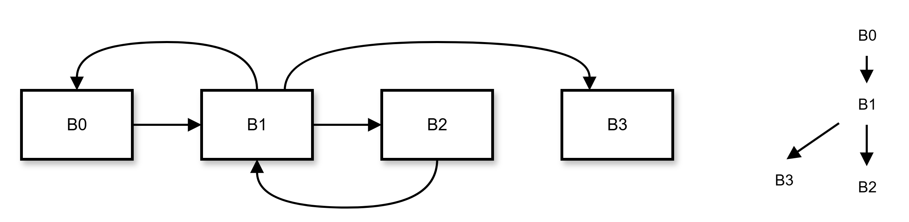

# Loop Detection

要进行循环相关的优化，我们首先要进行对循环的识别。这包括

- 找出所有的循环头节点（每个头节点对应一个循环）
- 对每个循环，找出它的 Latch 节点
- 对每个循环，找出它所有的节点
- 维护循环间嵌套关系

## 寻找循环头节点

我们可以检测循环的回边，这基于支配树分析。直观上，如果 A 是 B 的前驱，但是 B 支配 A，A -> B 就一定是一个循环的回边。

例如图中 B1 -> B0, B2 -> B1 就是不同循环的回边。回边所指向的节点一定是某个循环的 Header。

基于这个，我们遍历所有节点，对于某个节点 B，如果 B 支配它的某个前驱，那 B 就是以它为 Header 循环的头节点，而所有 B 所支配的前驱都是这个循环的 Latch（并且循环没有其它 Latch）

## 构建循环

一旦我们找到了循环 L 的头节点 Header 和它所有的 Latch，就可以找到这个循环的所有节点。

因为我们知道循环中的节点一定满足两个条件

- 被 Header 支配
- 可以到达某个 Latch 节点

所以只要顺着 Latch 寻找被 Header 支配的前驱，将它们加入循环即可。

据此可以构建循环检测算法。一开始循环 L 中只有 Header 一个节点，我们需要通过算法来收集循环 L 的其它节点。我们使用工作表法，工作表初始化为所有的 Latch 节点。我们重复执行以下过程直到工作表为空：

- 从工作表取出一个节点 A

- 如果 A 不属于 L，将 A 加入循环 L，并遍历 A 的前驱基本块，将被 Header 支配的前驱加入工作表

现在我们拥有了寻找循环头节点和构建循环的方法，只需要找出所有的循环头节点，并且给它们每个运行一遍构建循环的方法，循环检测的任务就完成了。

## 处理嵌套循环

目前的算法还有一些问题

- 不能维护循环的嵌套关系
- 假设 A 是 B 的内层循环，找出 A 的所有节点后，理论上可以把它们直接加入 B，但我们的做法是在 B 重新检测一遍

为了解决第二个问题，首先需要在寻找头节点时，按照支配树后序进行搜索。由于外层循环头节点支配内层循环头节点，这样一定能先检测内层循环再检测外层循环。

然后可以改进循环检测算法。

首先创建一个全局的 map `bb_to_loop`，以记录每个节点属于的最内层循环。在发现某个循环 L 的头节点 A 时，设置 `bb_to_loop[A] = L`。

然后我们使用工作表法，工作表仍然初始化为所有的 Latch 节点。重复执行以下过程直到工作表为空：

- 从工作表取出一个节点 A

- 如果 `bb_to_loop[A]` 为空，将 A 加入循环 L，然后
	- 设置 `bb_to_loop[A] = L`
	- 遍历 A 的前驱基本块，将被 L 的 Header 支配的前驱加入工作表
- 如果 `bb_to_loop[A] = M` 但 M 不等于 L。这意味着我们发现了一个子循环 M 里的节点，需要
	1. 寻找 M 目前的最外层循环 C（不能直接使用 M，因为假如 L 嵌套 C 嵌套 M，现在需要将 C 而非 M 的节点加入 L）
	2. 将 C 的所有节点加入 L，并且将 C 设置为 L 的子循环
	3. 注意我们需要避免两次遇到 C 的节点时重复添加。由于第二步，下次遍历到 C 中的节点时，它属于的最外层循环是 L 而非 C，所以我们可以在第一步发现找到的最外层循环就是 L 时，不进行后序添加操作

## 代码撰写

发现循环头的算法对应 `LICM.cpp` 中的 `run` 函数，助教已经写好。构建循环的算法对应了 `LICM.cpp` 中的 `discover_loop_and_sub_loops` 函数，需要你进行填写。

下面的动图可能对你理解这个 pass 有所帮助：
{width="400"}
